# Importer un calendrier <!-- omit in toc -->

Vous pouvez importer et synchroniser un calendrier dans votre application de gestion de calendrier préférée.

## Table des matières <!-- omit in toc -->

- [Importer en lecture-écriture](#importer-en-lecture-écriture)
- [Importer en lecture-seulement](#importer-en-lecture-seulement)
  - [À travers Nextcloud](#à-travers-nextcloud)
  - [À travers l'application web](#à-travers-lapplication-web)

## Importer en lecture-écriture

Si vous désirez gérer votre calendrier à l'extérieur de l'application web, c'est-à-dire utiliser un client comme Google Calendar, Outlook, Mozilla Thunderbird ou autre pour voir, créer et modifier vos événement, les instructions qui suivent vous expliquent comment faire. Si vous cherchez à synchroniser votre calendrier en lecture seulement, veuillez voir [Importer en lecture seulement](#importer-en-lecture-seulement).

1. Connectez-vous à votre compte sur l'application au <https://cloud.rei-uqode.ca/login>.
    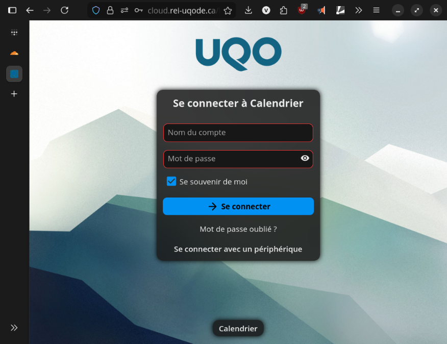
2. Sélectionnez le crayon « Modifier et partager » près du calendrier que vous voulez synchroniser.
    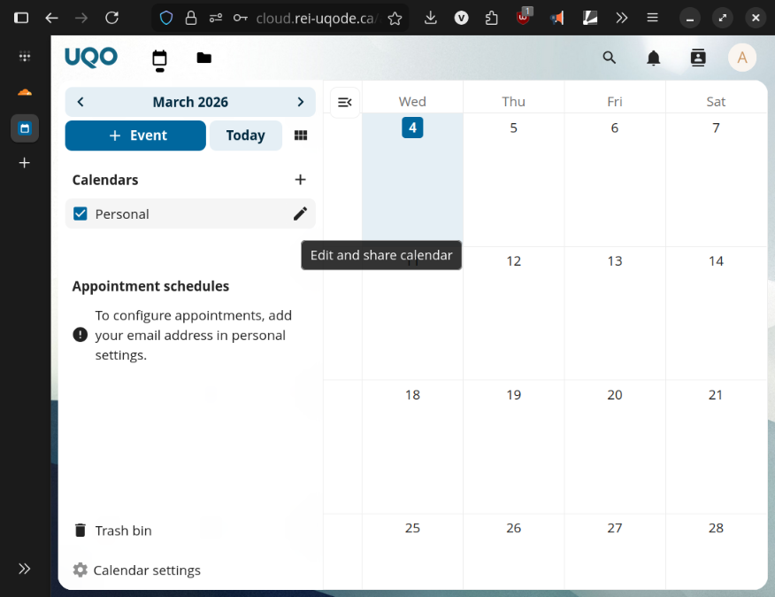
3. Sélectionnez « Lien interne » pour copier le lien d'abonnement.
    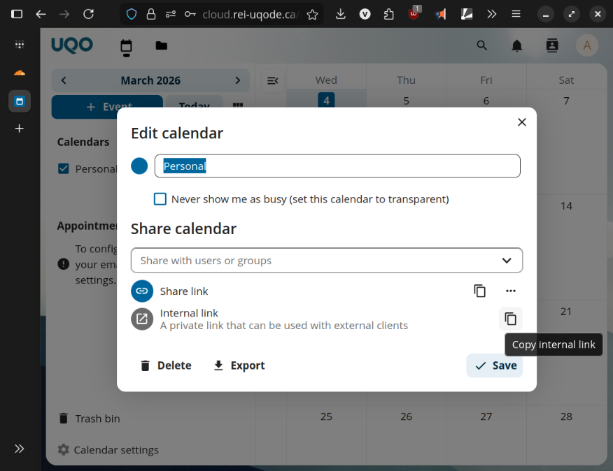
4. Ouvrez votre application de gestion de courriel préférée et créez un nouveau calendrier
    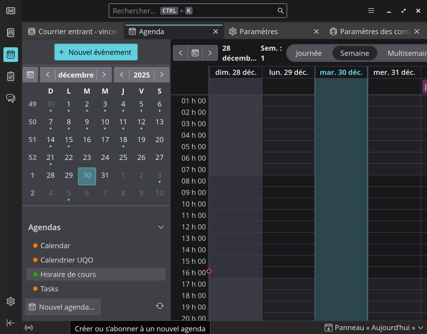
5. Sélectionner « Importer avec une URL ».
    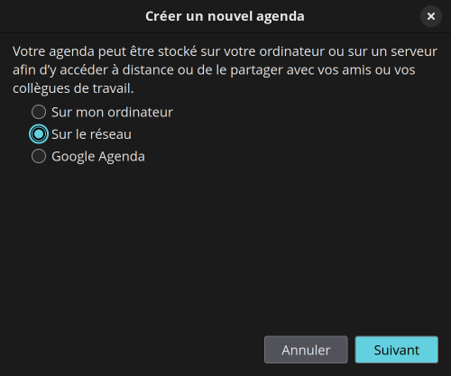
6. Collez le lien que vous avez copié et indiquez votre nom d'utilisateur Nextcloud ainsi que votre mot de passe.
    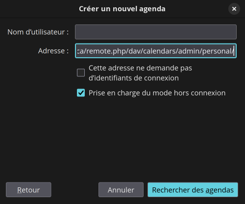

Notez qu'il est important que votre application vous permettes d'entrer votre nom d'utilisateur/mot de passe, car sinon vous ne serez en mesure ni de voir, ni de modifier le calendrier.

## Importer en lecture-seulement

### À travers Nextcloud

Vous pouvez partager un lien d'abonnement à travers Nextcloud directement.

1. Connectez-vous à votre compte sur l'application au <https://cloud.rei-uqode.ca/login>.
    
2. Sélectionnez le crayon « Modifier et partager » près du calendrier que vous voulez synchroniser.
    
3. Sélectionnez « Copier lien d'abonnement » pour copier le lien d'abonnement.
    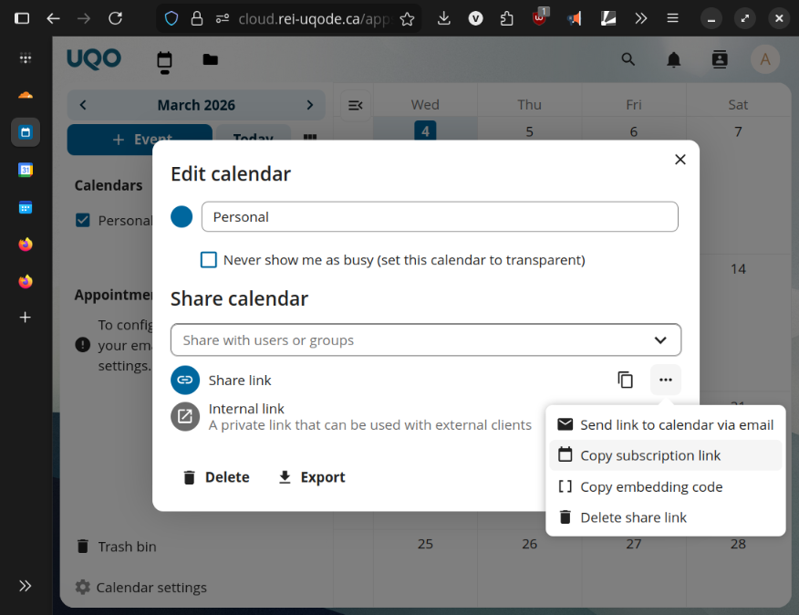
4. Ouvrez votre application de gestion de courriel préférée et créez un nouveau calendrier
    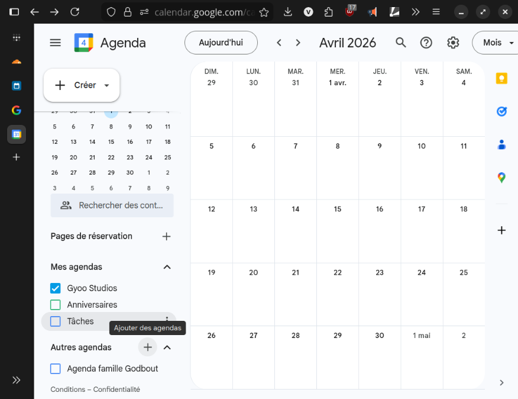
5. Sélectionner « Importer avec une URL ».
    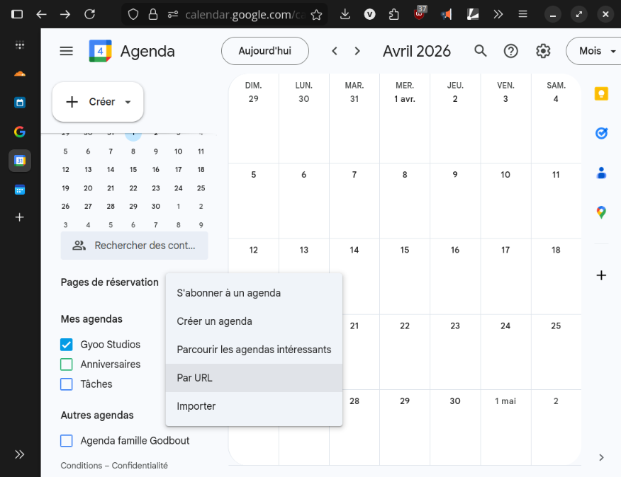
6. Collez le lien que vous avez copié.
    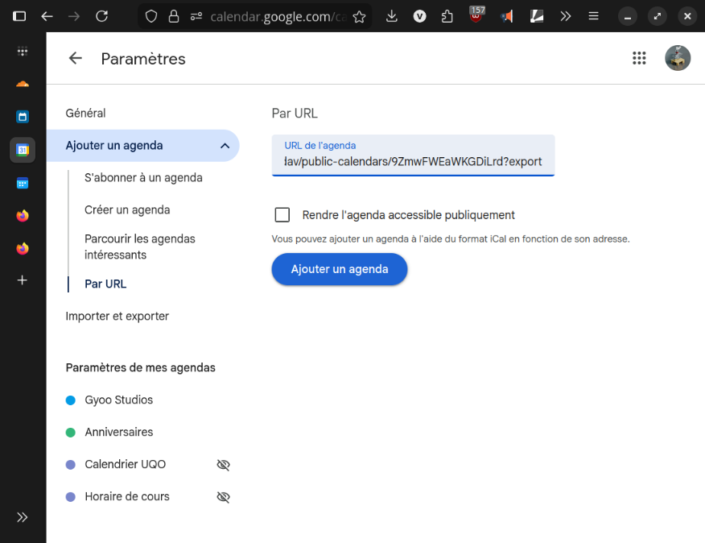

### À travers l'application web

Si vous n'avez pas accès à un lien d'abonnement fournit par votre association, vous pouvez vous abonner directement avec l'application web.

1. Visitez l'application web à <https://calendrier.rei-uqode.ca>
    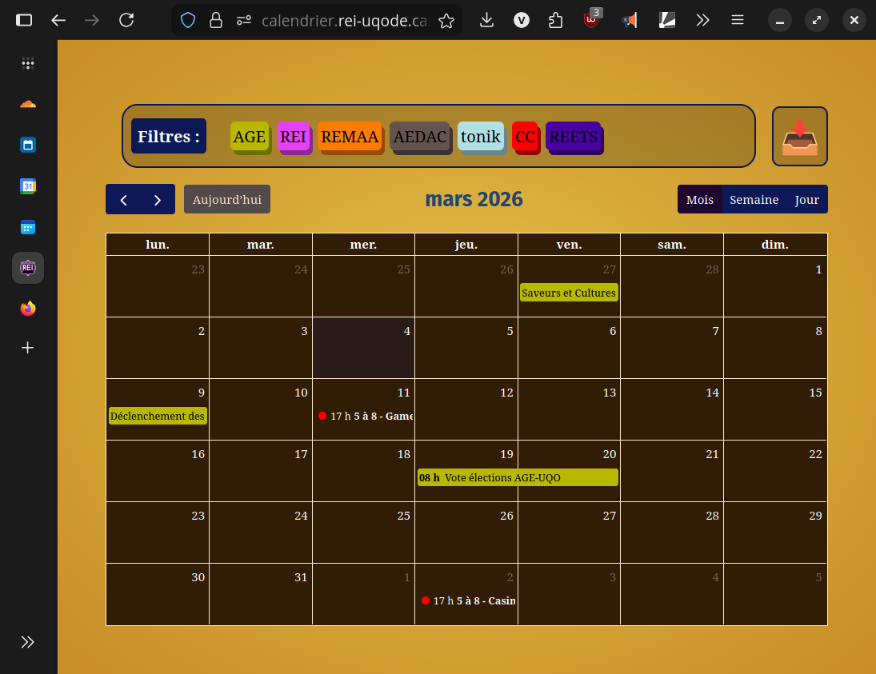
2. Ouvrez le dialogue d'abonnement en appuyant sur la flèche vers le bas, en haut à droite.
    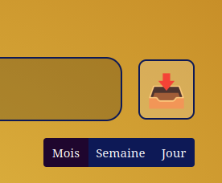
3. Sélectionnez le calendrier auquel vous désirez vous abonner.
    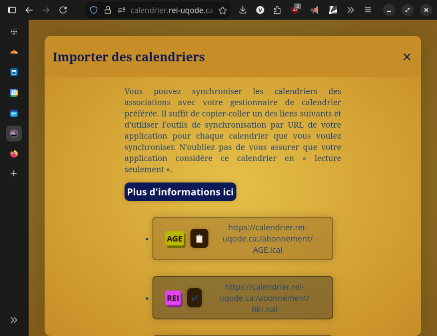
4. Ouvrez votre application de gestion de courriel préférée et créez un nouveau calendrier
    
5. Sélectionner « Importer avec une URL ».
    
6. Collez le lien que vous avez copié.
    