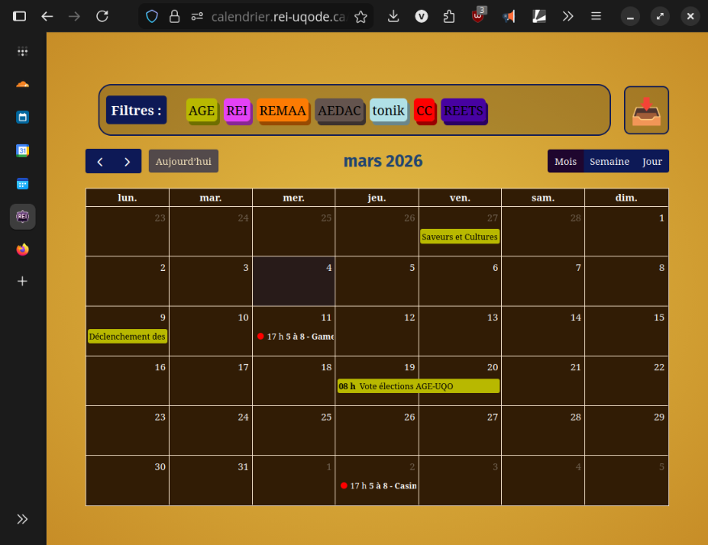
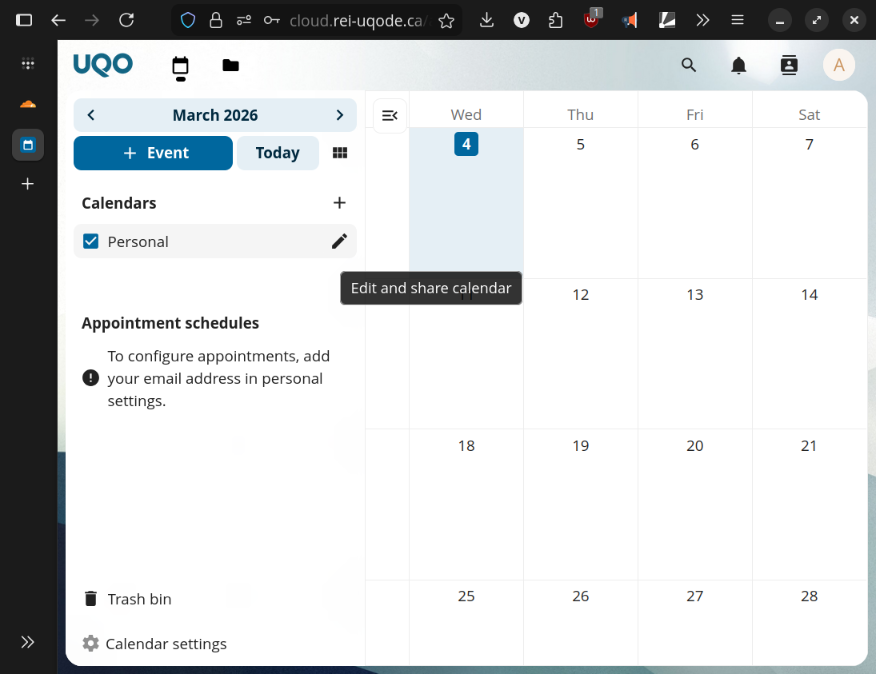
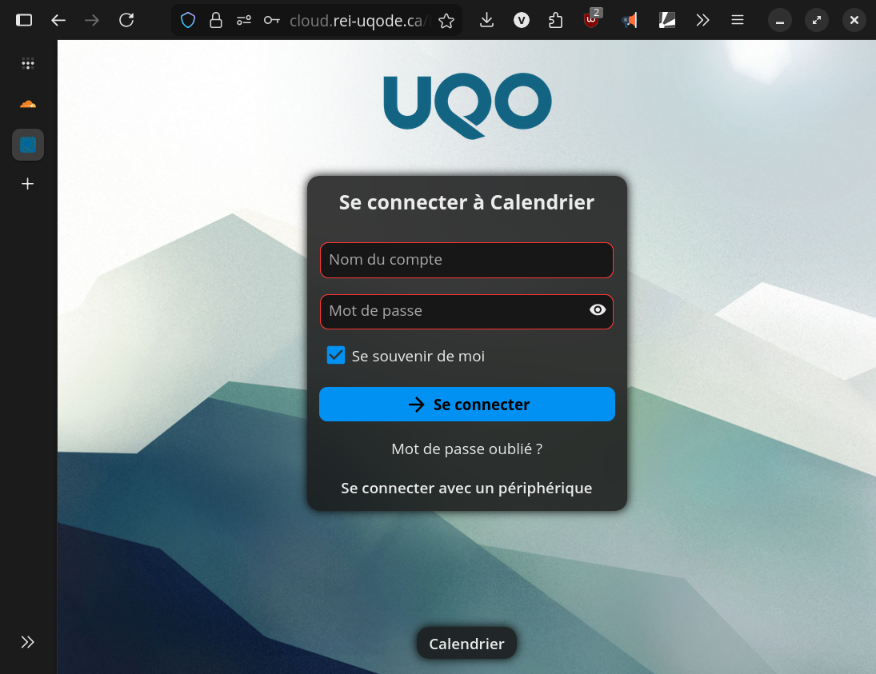
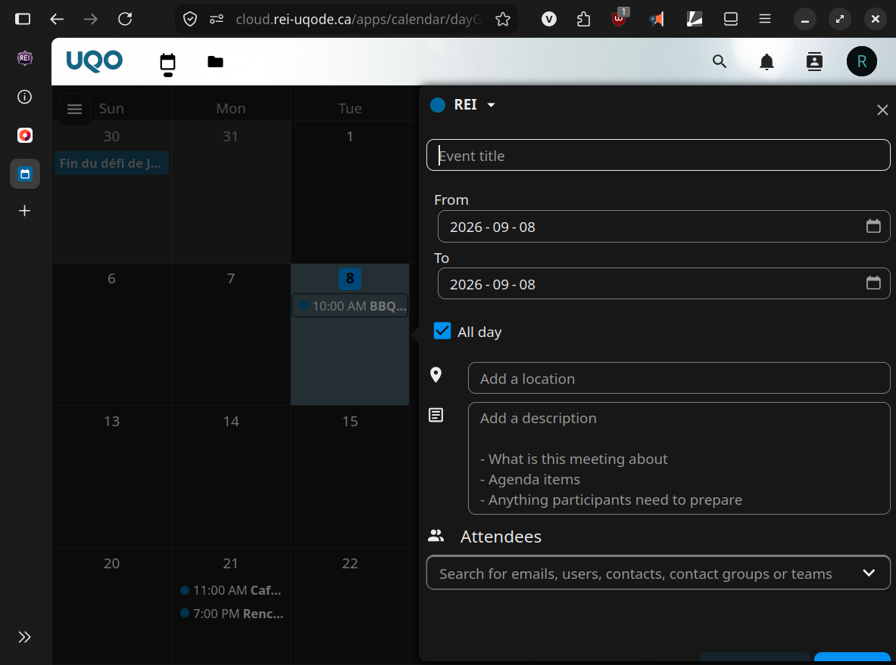
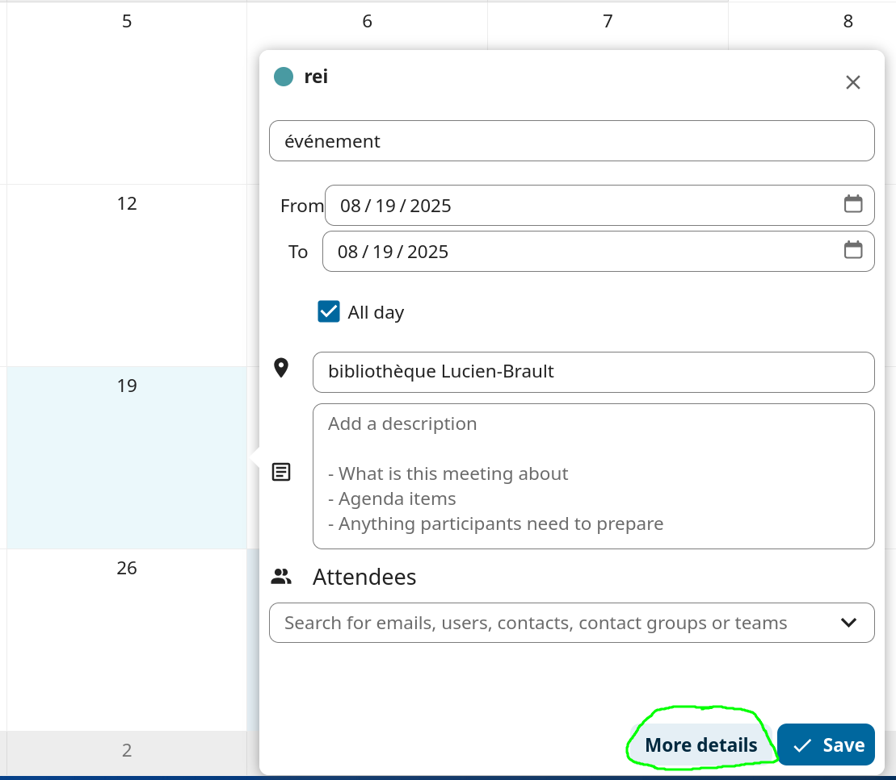
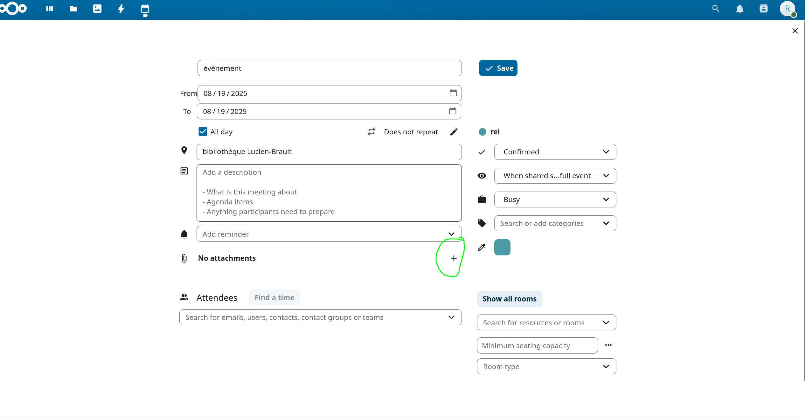
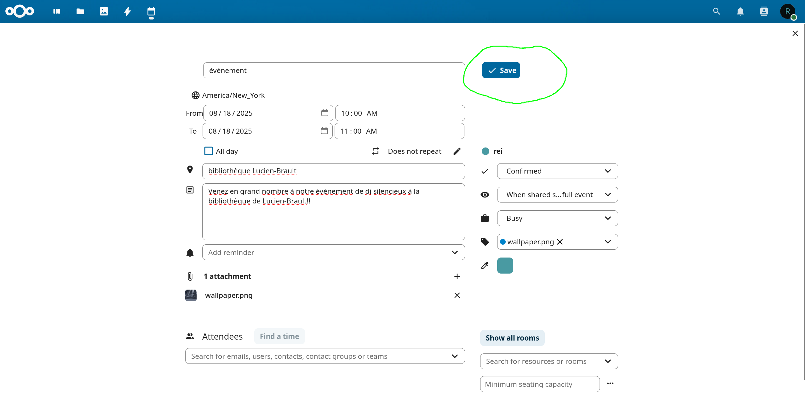

# Calendrier des Associations

Le calendrier des associations étudiantes vous est fournis par le comité UQODE du Regroupement des Étudiants en Informatique (REI) pour l'organisation et la synchronisation de toutes les associations étudiantes de l'UQO. Le site web est composé de deux parties, une section cliente, accessible à tous pour accéder aux calendriers de toutes les associations et une section administration, réservée aux associations pour gérer leur calendrier.

Vous pouvez accéder à la section cliente sur https://calendrier.rei-uqode.ca : 

Et à la section administration sur https://cloud.rei-uqode.ca : 

## Créer un compte

Afin de créer un compte avec une association, vous devrez contacter l'UQODE afin qu'ils vous en fournissent un. Vous aurez besoin de leur fournir les informations suivantes :

1. Le nom de votre association étudiante
2. Son adresse courriel
3. Un mot de passe
4. Un code de couleur hexadécimal représentant votre association sur le côté client. Une interface intuitive est disponible en ligne [ici](https://htmlcolorcodes.com/color-picker/).

## Se connecter

1. Rendez-vous sur https://cloud.rei-uqode.ca

  - 

2. Insérez le nom de votre association tout en majuscule et son mot de passe
   - Ex. : 
     - UQODE
     - MotDePasse2026!!

> [!NOTE]
> Si vous avez oublié votre mot de passe, veuillez contacter l'UQODE à uqode@uqo.ca et ils vous le réinitialiserons.

## Créer un événement

Afin de créer un événement, il suffit de cliquer sur la date de l'événement et de remplir les informations.

La description de l'événement supporte le Markdown, un langage de formattage de texte simple. Ce formattage apparaîtra dans l'application web, mais pas dans les applications de calendrier personnels.

[Plus d'information sur le Markdown](./Aide_Markdown.md)

L'application web supporte aussi une image promotionelle. Pour l'ajouter, il vous suffit de l'ajouter en pièce jointe. Appuyez sur « Plus de détails » : 

Ajoutez une pièce jointe : 

Enregistrez l'événement : 

Votre événement devrait se synchroniser sur l'application web d'ici quelques minutes.

## Utiliser l'application web

Rendez-vous sur https://calendrier.rei-uqode.ca : 

Vous pouvez choisir votre mode de vue entre le moi, la semaine et le jour en haut à droite, changer de moi/semaine/jour avec les flèches en haut à gauche et revenir à aujourd'hui avec le bouton « Aujourd'hui ».

En appuyant sur les associations en haut de l'écran, vous pouvez cacher leur calendrier respectif.

Vous pouvez importer les calendrier pour utilisation dans votre application préférée avec le bouton de téléchargement en haut à droite. [Plus d'information ici](./Importer_un_calendrier.md)

## [Gérer le calendrier depuis votre application](./Importer_un_calendrier.md)

## Aide, Commentaire, Suggestion

Pour toute aide, commentaire ou suggestion, veuillez contacter uqode@uqo.ca